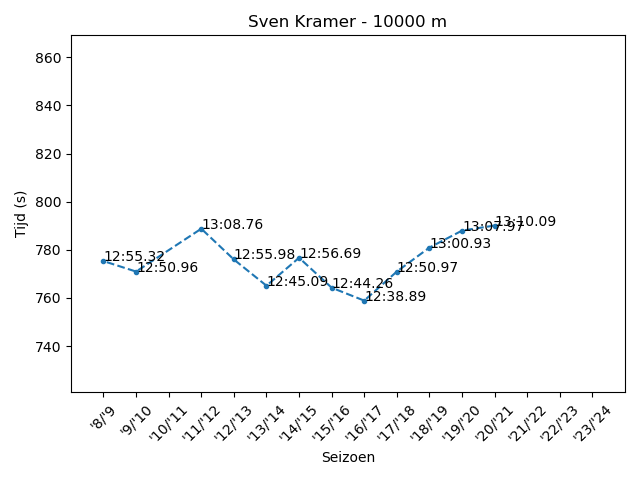
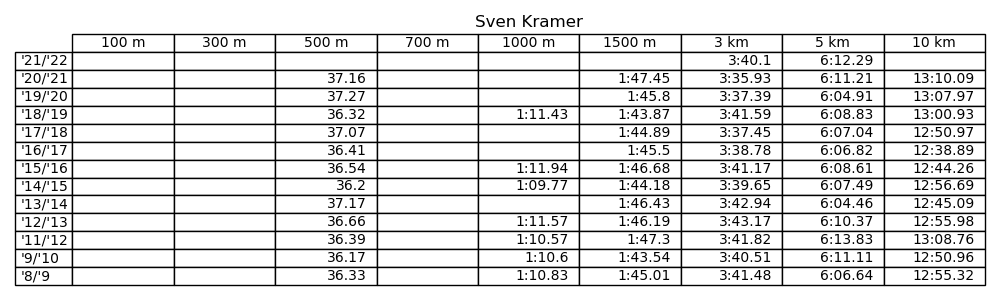

# speedskateresults
Python script to visualize season bests of speed skaters
----
This repository contains a simple script that can extract skater's season bests from [SpeedskatingResults.com](https://speedskatingresults.com). To evaluate specific skaters, add their ID to line 20 and their name to line 21 in the code. The skater ID can be found [here](https://speedskatingresults.com/index.php?p=202) under 'Skater IDs'.

The script generates a .csv table containing the results. It also generates a table image, and for each distance that contains more than one data point, it will also generate images to see how a skater's season best changed over the years. Example figures are shown below.

